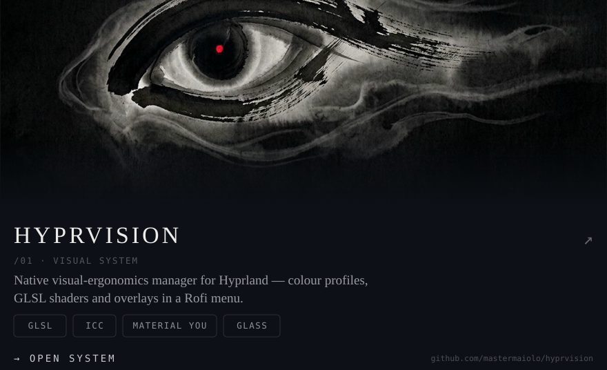
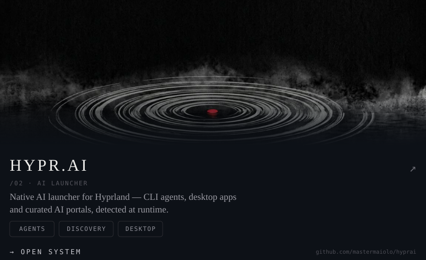
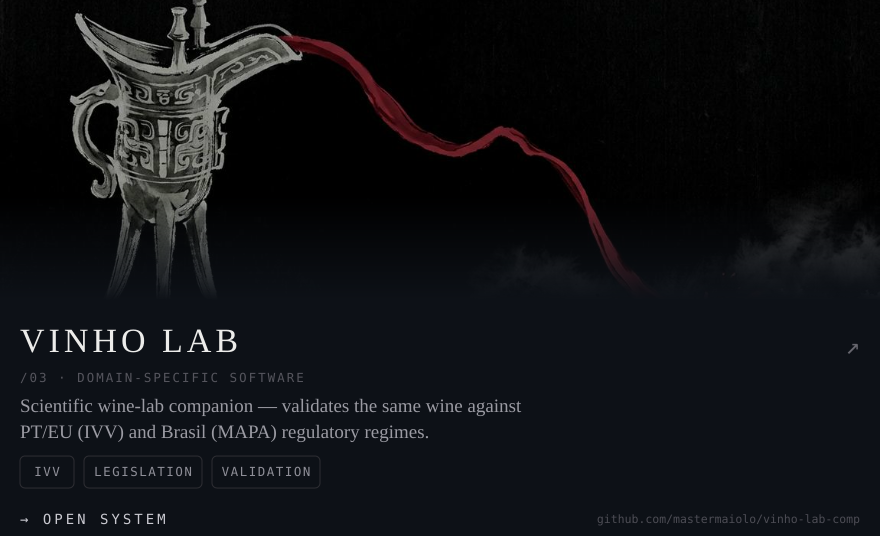
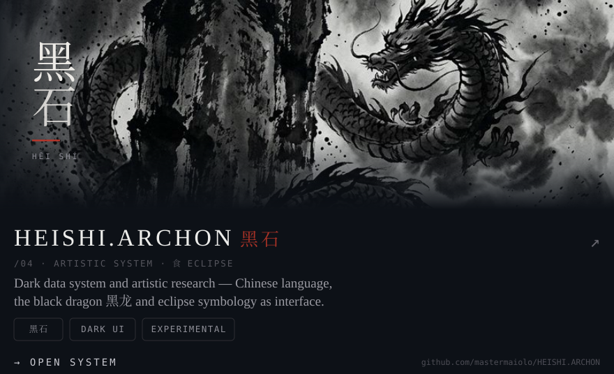
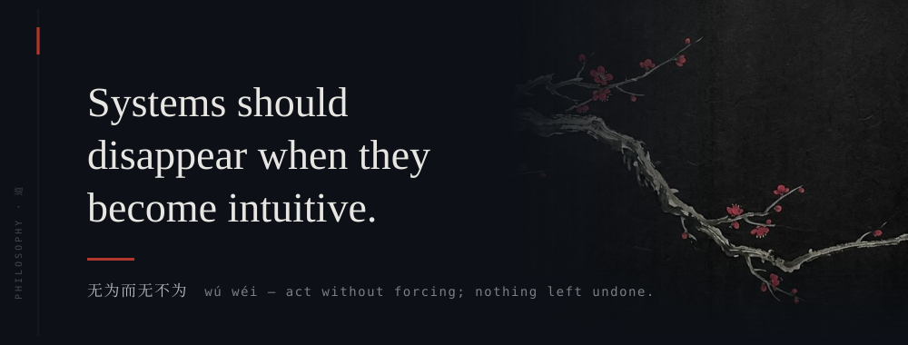
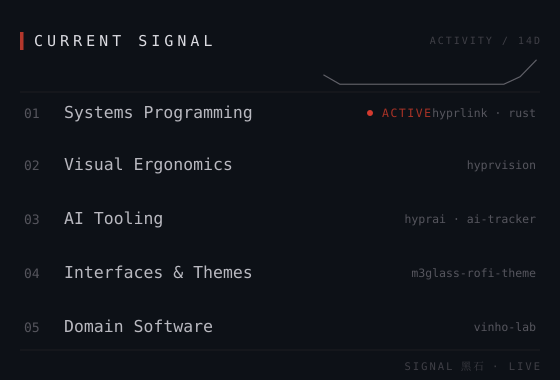
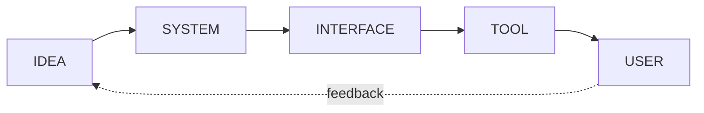

<!-- ═══════════════════════════════════════════════════════════════
     M A G G I O  ·  S Y S T E M S   L A B  ·  黑石
     profile ui composed as pure svg assets — no widgets, no trackers
     ═══════════════════════════════════════════════════════════════ -->

  

 

<table width="100%">
  <tr>
    <td width="50%"></td>
    <td width="50%"></td>
  </tr>
  <tr>
    <td width="50%"></td>
    <td width="50%"></td>
  </tr>
</table>

 

<table width="100%">
  <tr>
    <td width="64%"></td>
    <td width="36%"></td>
  </tr>
</table>

 

 

 

  
<b>LAB NOTES</b> · 试作 — open the experimental layer

   

  → **shaders** — GLSL overlays & colour science in [`hyprvision`](https://github.com/mastermaiolo/hyprvision)
  → **systems** — window-manager adjacent tooling, latest in [`hyprlink`](https://github.com/mastermaiolo/hyprlink) (Rust)
  → **automation** — [`ai-tracker`](https://github.com/mastermaiolo/ai-tracker), dodging rush hours on AI platforms
  → **interface systems** — Material You glass, done native: [`m3glass-rofi-theme`](https://github.com/mastermaiolo/m3glass-rofi-theme)
  → **strange prototypes** — [`HEISHI.ARCHON`](https://github.com/mastermaiolo/HEISHI.ARCHON) · 黑石

   

  the loop closes where the interface disappears.

 

