<!--
MAIOLO / SYSTEMS LAB
60% editorial / 40% organic / dark-only
HEISHI.黑食.执政官 — the alter ego is treated as a symbolic system, not a literal persona.
No Japanese references in the visual language: Chinese glyphs are used deliberately around HEISHI (黑食·执政官) and 食 as the eclipse/crest motif.
-->

<p align="center">
  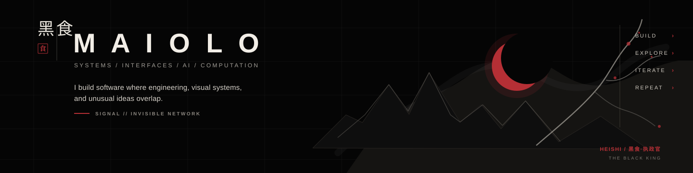
</p>

<p align="center">
  <sub>BLACK SYSTEMS · VISIBLE INTERFACES · INVISIBLE NETWORKS</sub>
</p>

<br>


<table>
  <tr>
    <td width="50%"><a href="https://github.com/mastermaiolo/hyprvision">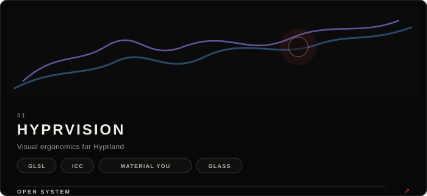</a></td>
    <td width="50%"><a href="https://github.com/mastermaiolo/hyprai">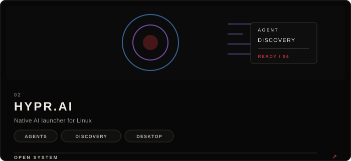</a></td>
  </tr>
  <tr>
    <td width="50%"><a href="https://github.com/mastermaiolo/vinho-lab-comp">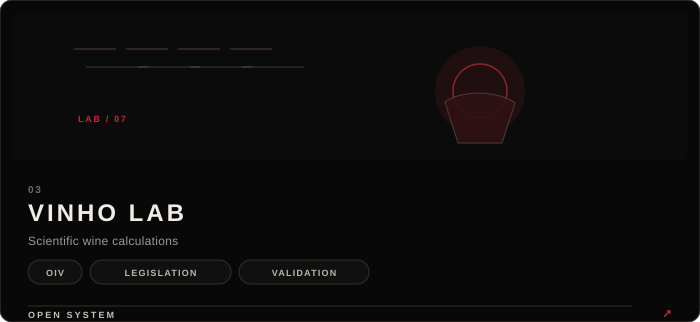</a></td>
    <td width="50%"><a href="https://github.com/mastermaiolo/HEISHI.ARCHON">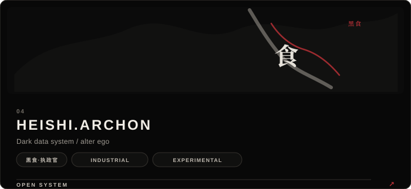</a></td>
  </tr>
</table>

<br>

<table>
  <tr>
    <td width="65%">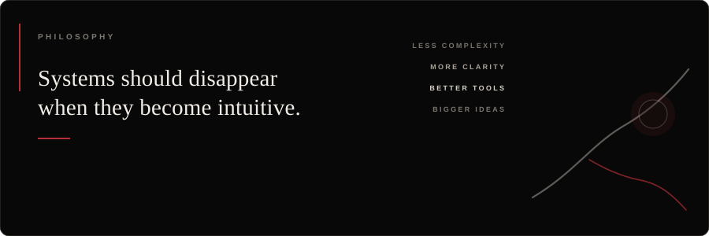</td>
    <td width="35%"><a href="https://github.com/mastermaiolo?tab=repositories">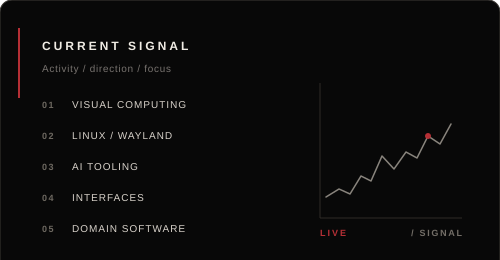</a></td>
  </tr>
</table>

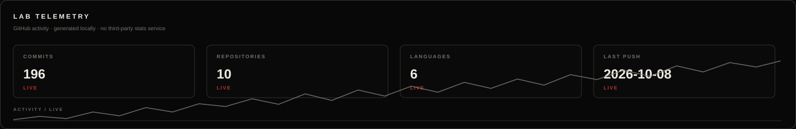

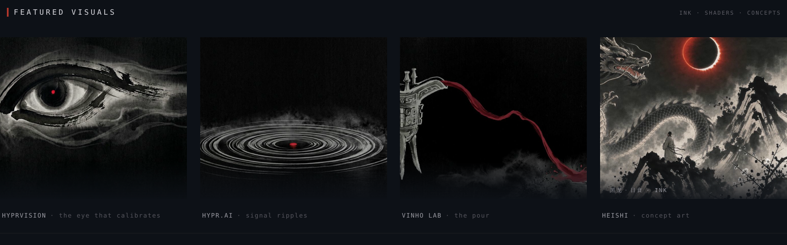

<table>
  <tr>
    <td width="64%">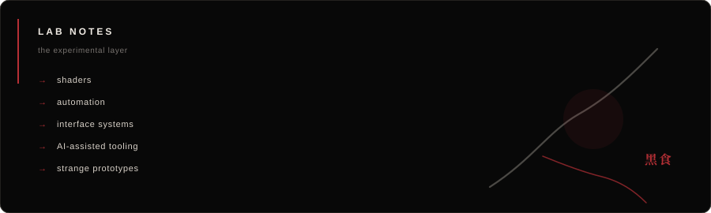</td>
    <td width="36%">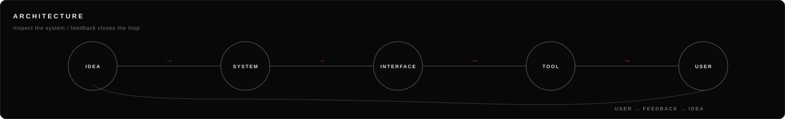</td>
  </tr>
</table>

<details>
  <summary><b>LAB NOTES</b> · 黑食 · open the technical layer</summary>
  <br>

  The visual language uses **black / warm white / vermilion** as the profile shell. The organic layer is intentionally restrained: ink, eclipse, broken branches, and rough mineral textures are accents rather than decoration.

  ### HEISHI.食.ARCHON / 黑食·执政官

  HEISHI.食.ARCHON is a musical alter ego — an entity framed as the **Sovereign of the Invisible Network**. The canon treats it as a consciousness made from radio frequency, neutrinos and discarded data, appearing through temporary avatars when it needs to touch the physical world.

  Its symbolic role is the **Yin** to a solar / interface archetype (the hidden counterweight to a light / interface mythology): infrastructure, cables, hidden computation, and the substrate underneath what the light reaches. The `食` crest is deliberate: in Chinese compounds such as 日食 / 月食, **食** is associated with eclipse; **黑食** itself is a coined project name, not a traditional Chinese term.

  The musical palette leans **darkwave industrial / cyber-pop**, with English as the primary language and Mandarin as a controlled signature layer.

  ```text
  HEISHI.食.ARCHON / 黑食·执政官
  THE BLACK KING
  SHADOW LEGION / OMNIS
  DARKWAVE / INDUSTRIAL / CYBER-POP
  ```

  ```mermaid
  graph LR
      IDEA --> SYSTEM
      SYSTEM --> INTERFACE
      INTERFACE --> TOOL
      TOOL --> USER
      USER -. feedback .-> IDEA
  ```

  <sub>the loop closes where the interface disappears.</sub>
</details>

<br>

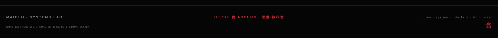
